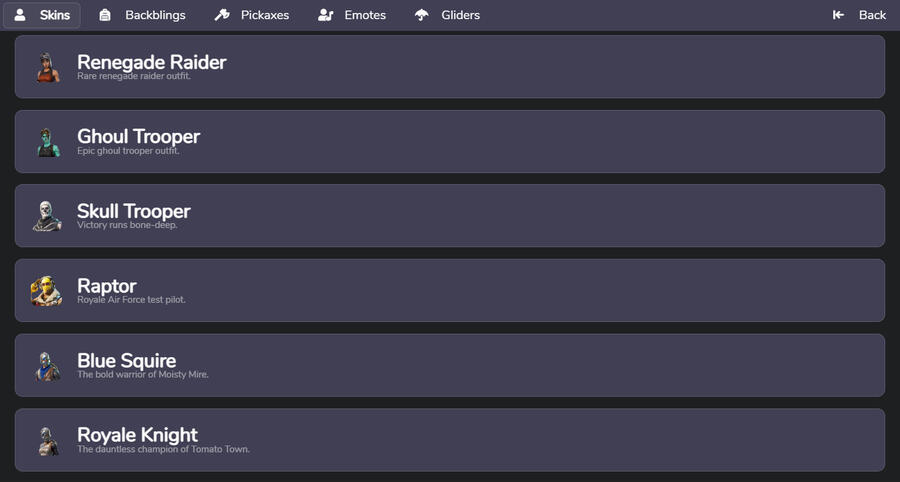

# Fortnite Skin Changer  
*A streamlined utility focused on visual customization and cosmetic exploration in Fortnite. This project brings together appearance-related concepts such as outfits, back blings, pickaxes, and visual presets into a single, well-organized archive. It is designed for players and enthusiasts who want a clear, practical way to review and explore cosmetic styles and presentation ideas in a simple, ready-to-use format.*

---

## Table of Contents
- [Introduction](#introduction)
- [Problem & Solution Overview](#problem--solution-overview)
- [Key Features & Highlights](#key-features--highlights)
- [Practical Use Cases](#practical-use-cases)
- [Screenshots & Visuals](#screenshots--visuals)
- [Technical Overview](#technical-overview)
- [Installation & Basic Usage](#installation--basic-usage)
- [Target Audience](#target-audience)
- [Project Status & Updates](#project-status--updates)
- [FAQ](#faq)
- [License](#license)
- [Final Summary & Call to Action](#final-summary--call-to-action)

---

## Introduction

**Fortnite Skin Changer** is created to provide a clean and approachable way to explore cosmetic customization concepts within Fortnite.  
The project focuses on visual elements and presentation, offering an organized structure that makes it easy to browse, review, and compare different cosmetic styles.

Everything is packaged into a single archive so users can quickly download and explore the content without additional setup or complexity.

---

## Problem & Solution Overview

Fortnite offers a wide variety of cosmetic content, but information and examples are often scattered across different sources.  
This can make it difficult to get a clear overview of available styles and how cosmetic elements are grouped or presented.

This project addresses that by offering a centralized archive that organizes cosmetic-related content into a consistent and easy-to-navigate structure.

---

## Key Features & Highlights

- Organized structure focused on Fortnite cosmetics  
- Clear presentation of outfits and visual styles  
- Lightweight archive designed for quick access  
- Minimal setup with immediate usability  
- Emphasis on clarity and ease of exploration  

Each feature is designed to help users get value quickly after downloading.

---

## Practical Use Cases

- Exploring different outfit and cosmetic style combinations  
- Reviewing visual presentation concepts  
- Comparing cosmetic layouts and themes  
- Using the archive as a reference for cosmetic organization ideas  

These use cases highlight practical and common ways the project can be explored.

---

## Screenshots & Visuals

  

---

## Technical Overview

The project uses a simple and transparent structure that prioritizes readability.  
Files are grouped logically, allowing users to quickly understand how cosmetic elements are organized within the archive.

This approach keeps the project accessible and easy to navigate.

---

## Installation & Basic Usage

1. Click the **Download ZIP** badge at the top of this page  
2. Extract the downloaded archive to any local folder  
3. Open the included files and explore the provided structure  

The process is designed to be fast and straightforward.

---

## Target Audience

This project is suitable for:
- Fortnite players interested in cosmetic customization  
- Enthusiasts exploring visual styles and themes  
- Users who prefer ready-to-use, well-organized archives  

It is ideal for anyone who values clarity and simplicity when working with cosmetic content.

---

## Project Status & Updates

**Status:** Active  

Possible future updates may include:
- Expanded cosmetic examples  
- Improved organization and layout  
- Additional visual references  

---

## FAQ

**Is this easy to explore?**  
Yes. The archive is designed to be clear and user-friendly.

**Do I need additional tools?**  
No. Everything needed is included in the downloaded archive.

**Can I explore it at my own pace?**  
Yes. The structure is flexible and easy to navigate.

---

## License

This project is distributed under the **MIT License**.

---

## Final Summary & Call to Action

**Fortnite Skin Changer** provides a clean and practical way to explore cosmetic customization concepts in Fortnite.  
With its organized structure and ready-to-use archive, it offers immediate value and a smooth exploration experience.

👉 **Download the ZIP archive above and explore the project directly.**
